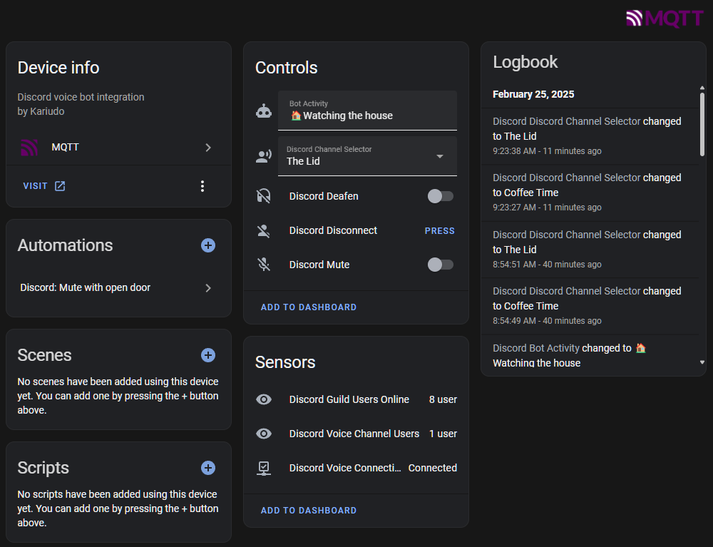
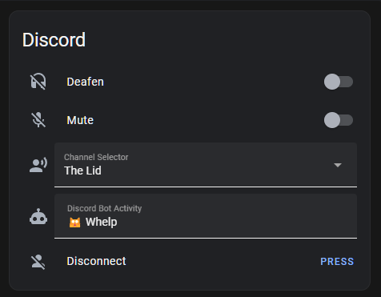

[](https://GitHub.com/Naereen/StrapDown.js/graphs/commit-activity)
[](https://app.deepsource.com/gh/kariudo/homeassistant-discord-bot/)
[](https://github.com/kariudo/homeassistant-discord-bot/actions/workflows/github-code-scanning/codeql)
[](<[https://https://www.buymeacoffee.com/](https://www.buymeacoffee.com/kariudo)>)
[](https://jetpack.io/devbox/docs/contributor-quickstart/)


# Home Assistant Discord Bot

The Home Assistant Discord Bot offers a pile of features designed to enhance your Discord experience by leveraging Home Assistant's capabilities via MQTT for lightweight communication and automatic setup of devices and entities.

Some major functionalities include monitoring voice channel connections, tracking online presence and activities of friends, and executing commands for user and bot control. These commands enable users to mute or unmute themselves, deafen or undeafen, update the bot's activity status, and move your user between voice channels or just disconnect.

Leverage the above control with Home Assistant automations as well to give yourself clever control
over your audio status or channel location. My favorite use so far is moving myself to
our AFK channel whenever I leave my office, since I have a habit of forgetting, as well
as moving me back or umuting me so I don't sit there talking to myself... as often 👍🏻.

*Consider keeping me caffinated:*

[](https://ko-fi.com/kariudo)
[](https://www.buymeacoffee.com/kariudo)


## Supported Commands & Features

- `mute`: Mutes the user in the voice channel.
- `unmute`: Unmutes the user in the voice channel.
- `deaf`: Deafens the user, so they can't hear others in the voice channel.
- `undeaf`: Undeafens the user, allowing them to hear others in the voice channel.
- `move {channel_name}`: Moves the user to the specified voice channel.
- `bot_activity {activity}`: Sets the bot's current activity status.
- `disconnect`: Disconnects the bot from the voice channel.

## Home Assistant Components

Provides the following devices/enties:

- *Discord* device (see screenshot below)
  - **Switches**:
    - *Mute*
    - *Deafen*
  - **Buttons**:
    - *Disconnect*
  - **Binary Sensors**:
    - *Voice connection*
  - **Sensors**:
    - *Users connected* (Count state, with member activities online attribute, voice channel presence)
      - Count (_state_)
      - onlne (_attribute_): includes user list with their active voice channel (with extra details on your user and the bot)
  - **Text**:
    - *Bot acitivity status*
  - **Select**
    - *Voice channel*


## Screenshots

### Device

Exposed sensors and controls are grouped together as a single `Discord` device.



### Dashboard

Easily add access to your voice channel controls to Home Assistant, and leverage them for automations.

**Conditional Card Example:**



**Conditional Card Example (YAML):**

```yml
type: conditional
conditions:
  - condition: state
    entity: binary_sensor.discord_user_voice_connection
    state: 'on'
card:
  title: Discord
  show_header_toggle: false
  state_color: true
  type: entities
  entities:
    - entity: switch.discord_user_deafen
      name: Deafen
    - entity: switch.discord_user_mute
      name: Mute
    - entity: select.discord_user_channel_selector
      name: Channel Selector
    - entity: text.discord_bot_activity
    - entity: button.discord_user_disconnect
      name: Disconnect
```

### Customizable Bot Name

Customize the name of the bot on your server, and set its status based on automations.


## Configuration

### Bot Token

1. Visit [Discord Developer Portal](https://discord.com/developers/applications) and create an new Application, you can
name this whatever you want. The bot display name can be configured seperately via the `.env` configuration.
2. Create a Discord Bot within the Application and copy the **Bot Token** from the `Bot` sub-page to `<BOT_TOKEN>`.

### Add the bot to the server

1. You can use the generated invite link that is printed to the console at startup to add the bot to the serer with
the required permissions.

### ENV variables

Most of the configuration is preflighted by your environment variables, the easiest setup is using a `.env` in the
project (a template file is provided in the root). Replace the appropriate values with yours:

```sh
# Copy to .env and replace <PLACEHOLDER> values with your ID and Token values etc.
BOT_TOKEN=<YOUR_BOT_TOKEN>
MQTT_URL=mqtt://192.168.1.110
MQTT_PORT=1883
MQTT_USERNAME=mqttbotuser
MQTT_PASSWORD=<YOUR_MQTT_PASSWORD>
TOPIC_DISCOVERY=homeassistant
TOPIC_BOT=discordbot
GUILD_ID=<YOUR_GUILD_ID>
YOUR_ID=<YOUR_ID>
BOT_ID=<YOUR_BOT_ID>
MQTT_CLIENT_ID=discordbot_bow_1
BOT_ACTIVITY="🏠Watching the house"
BOT_NICKNAME=Caduceus
```

### MQTT Connection Setup


1. Ensure that you have a configured `MQTT` broker and integration in Home Assitant.
2. Specify the MQTT broker URL and credentials in the `.env` file.
3. *[Optional]* Customize your MQTT topics in the `.env` file:

   ```conf
   # Home Asssistant base discovery topic
   TOPIC_DISCOVERY=homeassistant
   # Bot base topic
   TOPIC_BOT=discordbot
   ```

### Configure the ID Values

> Note: you will need to enable developer mode in your discord app settings to see the ID copy features in the context menus.

1. After you or an admin added your bot to a server you can right-click on the server name to copy the `GUILD_ID`.
2. `YOUR_ID` can be found by right-clicking on your name in the users tab of the server.
2. `BOT_ID` can be found by right-clicking on the bot's name in the users tab of the server, it will need to be added to the server first for this..

## Home Assistant Usage

MQTT discovery should present a device in home assistant for you to configure with all the available sensors, selects, switches. See the full list above, and screenshot examples.

### Direct Command Service

You can call commands directly (i.e.; to set the bot's activity etc.) using the `mqtt.publish` service:

```yml
service: mqtt.publish
data:
  qos: "0"
  retain: false
  topic: discordbot/command
  payload: bot_activity 🌮Thinking about tacos
```

## Docker Support

For the easiest use, just run the bot from docker with the published container image.

You just need to setup the `.env` file with your configuration and provide it:

```sh
docker run -it -v /<path_to_your_dotenv>/.env:/usr/src/app/.env ghcr.io/kariudo/homeassistant-discord-bot:latest
```

### Docker Compose Example

```yml
version: '3'
name: bots
services:
  homeassistant-discord:
    container_name: homeassistant-discord-bot
    image: ghcr.io/kariudo/homeassistant-discord-bot:latest
    volumes:
      - /share/Container/discord-bot/config/.env:/usr/src/app/.env
```
