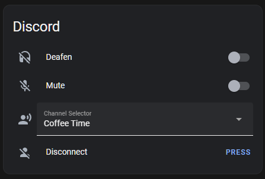

# Home Assistant Discord Bot

[](https://GitHub.com/Naereen/StrapDown.js/graphs/commit-activity)
[](https://typescriptlang.org)
[](<[https://https://www.buymeacoffee.com/](https://www.buymeacoffee.com/kariudo)>)

The Home Assistant Discord Bot offers a pile of features designed to enhance your Discord experience by leveraging Home Assistant's capabilities. Some major functionalities include monitoring voice channel connections, tracking online presence and activities of friends, and executing commands for user and bot control. These commands enable users to mute or unmute themselves, deafen or undeafen, update the bot's activity status, and move your user between voice channels or just disconnect.

Leverage the above control with Home Assistant automations as well to give yourself clever control
over your audio status or channel location. My favorite use so far is moving myself to
our AFK channel whenever I leave my office, since I have a habit of forgetting, as well
as moving me back or umuting me so I don't sit there talking to myself... as often 👍🏻.

## Supported Commands & Features

- `mute`: Mutes the user in the voice channel.
- `unmute`: Unmutes the user in the voice channel.
- `deaf`: Deafens the user, so they can't hear others in the voice channel.
- `undeaf`: Undeafens the user, allowing them to hear others in the voice channel.
- `move {channel_name}`: Moves the user to the specified voice channel.
- `bot_activity {activity}`: Sets the bot's current activity status.
- `disconnect`: Disconnects the bot from the voice channel.

## Screenshots

### Device

Exposed sensors and controls are grouped together as a single `Discord` device.


### Dashboard

Easily add access to your voice channel controls to Home Assistant, and leverage them for automations.



### Customizable Bot Name

Customize the name of the bot on your server, and set its status based on automations.


## Configuration

### Bot Token

1. Visit [Discord Developer Portal](https://discord.com/developers/applications) and create an new Application, you can
name this whatever you want. The bot display name can be configured seperately via the `.env` configuration.
2. Create a Discord Bot within the Application and copy the **Bot Token** from the `Bot` sub-page to `<BOT_TOKEN>`.

### Add the bot to the server

1. You can use the generated invite link that is printed to the console at startup to add the bot to the serer with
the required permissions.

### MQTT

### MQTT Connection Setup


1. Ensure that you have a configured `MQTT` broker and integration in Home Assitant.
2. Specify the MQTT broker URL and credentials in the `.env` file:
   - `MQTT_BROKER_URL` should be set to your MQTT broker's URL.
   - `MQTT_BROKER_USERNAME` and `MQTT_BROKER_PASSWORD` should be set with your login credentials.
3. *[Optional]* Customize your MQTT topics in the `.env` file:

   ```conf
   # Home Asssistant base discovery topic
   TOPIC_DISCOVERY=homeassistant
   # Bot base topic
   TOPIC_BOT=discordbot
   ```

### Configure the ID Values

> Note: you will need to enable developer mode in your discord app settings to see the ID copy features in the context menus.

1. After you or an admin added your bot to a server you can right-click on the server name to copy the `<GUILD_ID>`.
2. `<YOUR_ID>` can be found by right-clicking on your name in the users tab of the server.
2. `<BOT_ID>` can be found by right-clicking on the bot's name in the users tab of the server, it will need to be added to the server first for this..

## Home Assistant Usage

MQTT discovery should present a device in home assistant for you to configure with all the available sensors, selects, switches.

### Direct Command Service

You can call commands directly (i.e.; to set the bot's activity etc.) using the `mqtt.publish` service:

```yml
service: mqtt.publish
data:
  qos: "0"
  retain: false
  topic: discordbot/command
  payload: bot_activity 🌮Thinking about tacos
```

## Docker Support

For the easiest use, just run the bot from docker with the published container image.

You just need to setup the `.env` file with your configuration and provide it:

```sh
docker run -it -v /<path_to_your_dotenv>/.env:/usr/src/app/.env ghcr.io/kariudo/homeassistant-discord-bot:latest
```